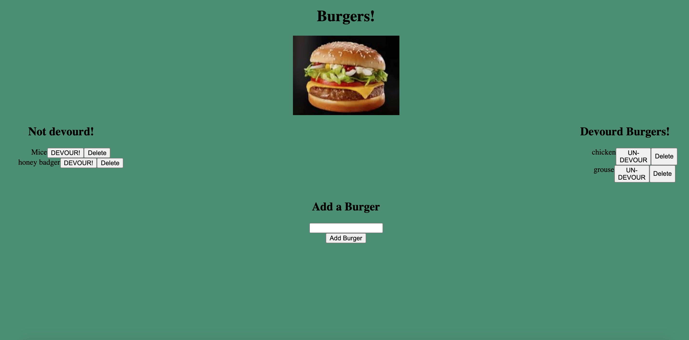

  # Burger!

  

  ## Description

  A full stack application where you can create a burger, devour the burger, un-devour the burger, and delete the burger.

  ## Images

  

  
  ## Table of Content

  * [Installation](#installation)

  * [Usage](#usage)

  * [License](#license)

  * [Contributing](#contributors)

  * [Contact](#questions/contact)

  ## Installation

  To Install necessary dependencies, run the following command:
  
  N/A

  ## Usage

      There is only one input bar with a handlful of buttons. To create a burger, enter the burgername into the input field and click the button. Once it is created it will be added to the left side of the screen. If you click, "Devour!" it will move to the right side of the screen. If you click "un-devour" it will move to the right side of the screen.
  
  ## Technologies

      Express, Express-Handlebars, mysql, javascript, html, css

  ## Contributors

  Ben Hopkin and UW coding bootcamp

  ## Questions/Contact

  <a href="https://github.com/bh007183">GitHub Profile</a>
  <a href="mailto:bjhops17@gmail.com"> Email Me</a>
  
  

  